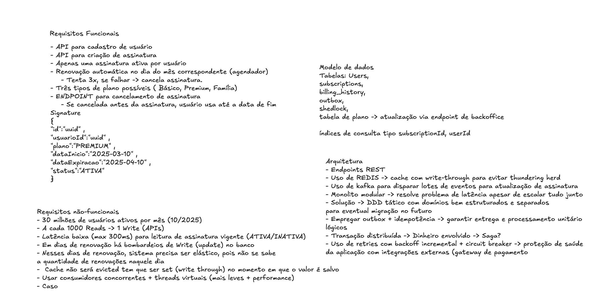

# 📦 Subscription Manager

## Introdução

Sistema de gestão de assinaturas recorrentes para um serviço de streaming. Usuários se cadastram, escolhem um plano mensal e o sistema cuida automaticamente de toda a cobrança: renovação no vencimento, retentativas com backoff exponencial em caso de falha, suspensão após o limite de tentativas e cancelamento com acesso garantido até o fim do ciclo pago.

O projeto foi construído como resposta a um desafio técnico, mas com uma barra de qualidade de produção: sem dual-write, sem cobrança duplicada, sem perda de estado entre reinicializações, escalável horizontalmente e com cobertura de testes em todas as camadas críticas.

---

## 🚀 Quick Start

### Pré-requisitos

- Docker + Docker Compose
- Java 21+
- (Opcional) `jq` para formatar as respostas JSON no terminal

### 1. Suba a infraestrutura

```bash
docker compose up -d
```

Aguarde ~10 segundos. Isso inicia PostgreSQL, Kafka (KRaft), Redis e Prometheus.

#### 1.1 Caso queira começar do zero limpando volumes

```bash
docker compose down -v --remove-orphans
```

### 2. Inicie a aplicação

```bash
./gradlew bootRun --args='--spring.profiles.active=local'
```

O perfil `local` ativa o WireMock (mock do gateway de pagamento) e o seeder de dados.

### 3. Rode os testes

```bash
./gradlew test
```

### Serviços disponíveis

| Serviço | URL |
|---|---|
| API | `http://localhost:8080` |
| **Swagger UI** | **`http://localhost:8080/swagger-ui.html`** |
| **OpenAPI JSON** | **`http://localhost:8080/v3/api-docs`** |
| Prometheus | `http://localhost:9090` |
| Métricas (raw) | `http://localhost:8080/actuator/prometheus` |

---

## 🎮 Cenários de Demonstração

> **Todos os cenários abaixo são executáveis com copy-paste.** A aplicação deve estar rodando com `--spring.profiles.active=local`.
>
> O backoff está configurado com `base-delay-minutes=1` — o ciclo completo de 3 falhas e suspensão é observável em **~7 minutos**.

### Tokens do Gateway (WireMock)

| Token | Comportamento |
|---|---|
| `tok_test_success` | Cobrança sempre aprovada ✅ |
| `tok_test_always_fail` | Cobrança sempre recusada — sub suspensa após 3 tentativas ❌ |
| `tok_test_fail` | Recusada (usado pelo seed no grupo "beira do abismo") |
| `tok_test_fail_first_attempt` | Falha na 1ª tentativa, aprovada na 2ª (máquina de estado WireMock) |

---

### 🧪 Cenário 1 — Criação e renovação bem-sucedida

```bash
# 1. Criar usuário
USER=$(curl -s -X POST http://localhost:8080/v1/users \
  -H "Content-Type: application/json" \
  -d '{"name":"João Silva","email":"joao@email.com","document":"12345678901"}')
echo $USER | jq .
USER_ID=$(echo $USER | jq -r '.id')

# 2. Criar assinatura (tok_test_success → sempre aprovado)
SUB=$(curl -s -X POST http://localhost:8080/v1/subscriptions \
  -H "Content-Type: application/json" \
  -d "{\"userId\":\"$USER_ID\",\"plan\":\"PREMIUM\",\"paymentToken\":\"tok_test_success\"}")
echo $SUB | jq .
SUB_ID=$(echo $SUB | jq -r '.id')

# 3. Consultar assinatura
curl -s http://localhost:8080/v1/subscriptions/$SUB_ID \
  -H "X-User-Id: $USER_ID" | jq .
```

**Resultado esperado:** `status: ACTIVE`, `plan: PREMIUM`, cobrança de R$ 39,90 registrada.

---

### 🧪 Cenário 2 — Cancelamento com acesso até o fim do ciclo

```bash
# Continuando do Cenário 1 — $USER_ID e $SUB_ID já definidos

# Cancelar assinatura
curl -s -X PATCH http://localhost:8080/v1/subscriptions/$SUB_ID/cancel \
  -H "X-User-Id: $USER_ID" -w "\nHTTP %{http_code}\n"

# Consultar — deve estar CANCELED, autoRenew=false, mas expiringDate no futuro
curl -s http://localhost:8080/v1/subscriptions/$SUB_ID \
  -H "X-User-Id: $USER_ID" | jq '{status, autoRenew, expiringDate}'
```

**Resultado esperado:** `status: CANCELED`, `autoRenew: false`. O usuário conserva acesso até `expiringDate`. O scheduler moverá para `INACTIVE` após o vencimento.

---

### 🧪 Cenário 3 — Seed em massa + sweep manual (todos os cenários de negócio)

```bash
# 1. Gera 20 assinaturas representando os 4 perfis de negócio:
#    70% renovação normal | 10% retry (falhou 1x) | 10% beira do abismo (falhou 2x) | 10% cancelados
curl -s -X POST "http://localhost:8080/api/test/seed?count=20"

# 2. Consulta estado inicial (antes do sweep)
curl -s http://localhost:8080/v1/admin/subscriptions | jq '[.[] | {id, status, plan, billing_attempts, next_retry_at}]'

# 3. Dispara o sweep manualmente (não precisa esperar o scheduler de 1 min)
curl -s -X POST http://localhost:8080/v1/admin/billing/trigger-sweep -w "HTTP %{http_code}\n"

# 4. Aguarda ~3s e consulta novamente — observe as transições:
#    ACTIVE(billingAttempts=0) → renovadas
#    ACTIVE(billingAttempts=2, tok_test_always_fail) → SUSPENDED
#    CANCELED → INACTIVE
sleep 3
curl -s http://localhost:8080/v1/admin/subscriptions | jq '[.[] | {id, status, billing_attempts}]'
```

**Resultado esperado após o sweep:**
- 16 assinaturas `ACTIVE` com `billing_attempts=0` (renovadas)
- 2 assinaturas `SUSPENDED` (atingiram 3 falhas)
- 2 assinaturas `INACTIVE` (eram CANCELED e venceram)

---

### 🧪 Cenário 4 — Retentativa com backoff exponencial

```bash
# Criar uma assinatura que falha na 1ª tentativa mas sucede na 2ª
USER2=$(curl -s -X POST http://localhost:8080/v1/users \
  -H "Content-Type: application/json" \
  -d '{"name":"Maria Retry","email":"maria@email.com","document":"98765432100"}')
USER2_ID=$(echo $USER2 | jq -r '.id')

SUB2=$(curl -s -X POST http://localhost:8080/v1/subscriptions \
  -H "Content-Type: application/json" \
  -d "{\"userId\":\"$USER2_ID\",\"plan\":\"BASICO\",\"paymentToken\":\"tok_test_fail_first_attempt\"}")
SUB2_ID=$(echo $SUB2 | jq -r '.id')

# 1º sweep → falha, billingAttempts=1, nextRetryAt=now+2min
curl -s -X POST http://localhost:8080/v1/admin/billing/trigger-sweep

# Aguarda backoff (2 min com base-delay=1)
echo "Aguardando backoff de 2 minutos..."
sleep 125

# 2º sweep → sucede, billingAttempts=0, status=ACTIVE renovada
curl -s -X POST http://localhost:8080/v1/admin/billing/trigger-sweep

sleep 3
curl -s http://localhost:8080/v1/subscriptions/$SUB2_ID \
  -H "X-User-Id: $USER2_ID" | jq '{status, billingAttempts}'
```

**Resultado esperado:** após o 2º sweep, `status: ACTIVE`, `billingAttempts: 0` (renovada com sucesso).

---

### 🧪 Cenário 5 — Força suspensão via admin (demonstração imediata)

```bash
# Pegar o ID de qualquer assinatura ACTIVE do seed
ACTIVE_ID=$(curl -s http://localhost:8080/v1/admin/subscriptions \
  | jq -r '[.[] | select(.status == "ACTIVE")] | first | .id')

echo "Suspendendo assinatura: $ACTIVE_ID"

# Forçar suspensão via admin (mesmo caminho do scheduler — suspendSubscriptionAtomic)
curl -s -X POST http://localhost:8080/v1/admin/subscriptions/$ACTIVE_ID/force-suspend \
  -w "HTTP %{http_code}\n"

# Confirmar no admin
curl -s http://localhost:8080/v1/admin/subscriptions \
  | jq "[.[] | select(.id == \"$ACTIVE_ID\") | {status, auto_renew, next_retry_at}]"
```

**Resultado esperado:** `status: SUSPENDED`, `auto_renew: false`, `next_retry_at: null`.

---

## 🛠️ Tecnologias

| Categoria | Tecnologia |
|---|---|
| Linguagem | Java 21 (Virtual Threads) |
| Framework principal | Spring Boot 3 / Spring Modulith |
| Banco de dados | PostgreSQL 15 |
| Mensageria | Apache Kafka (KRaft, Confluent 7.6) |
| Cache | Redis (Lettuce) |
| Migrações | Flyway |
| Lock distribuído | ShedLock (JDBC) |
| Resiliência | Resilience4j (Circuit Breaker + Retry) |
| Criptografia | AES-256-GCM (token de pagamento) |
| Mock de gateway | WireMock (perfil `local`) |
| Observabilidade | Micrometer + Prometheus |
| Testes | JUnit 5 + Mockito + Spring Modulith Verification |
| Build | Gradle (Kotlin DSL) |
| Conteinerização | Docker Compose |
| Redução de boilerplate | Lombok |

---

## 🗄️ MER — Modelo Entidade-Relacionamento

```
┌──────────────────────────────────┐
│              users               │
├──────────────────────────────────┤
│ id            UUID  PK           │
│ name          VARCHAR(255)       │
│ document      VARCHAR(20)  UNIQUE│
│ email         VARCHAR(255) UNIQUE│
│ created_at    TIMESTAMP          │
│ updated_at    TIMESTAMP          │
└──────────────────┬───────────────┘
                   │ 1
                   │
                   │ N
┌──────────────────▼───────────────┐
│           subscriptions          │
├──────────────────────────────────┤
│ id                UUID  PK       │
│ user_id           UUID  FK→users │
│ plan              VARCHAR(20)    │  ← BASICO | PREMIUM | FAMILIA
│ status            VARCHAR(20)    │  ← ACTIVE | CANCELED | SUSPENDED | INACTIVE
│ payment_token     VARCHAR(255)   │  ← AES-256-GCM encrypted
│ start_date        TIMESTAMP      │
│ expiring_date     TIMESTAMP      │
│ auto_renew        BOOLEAN        │
│ billing_attempts  INT            │
│ next_retry_at     TIMESTAMP      │
│ last_billing_attempt TIMESTAMP   │
│ version           BIGINT         │  ← Optimistic lock
│ created_at        TIMESTAMP      │
│ updated_at        TIMESTAMP      │
└──────────────────┬───────────────┘
                   │ 1
                   │
                   │ N
┌──────────────────▼───────────────┐
│          billing_history         │
├──────────────────────────────────┤
│ id                    UUID  PK   │
│ subscription_id       UUID  FK   │
│ idempotency_key       VARCHAR    │  ← UNIQUE: {subId}-{ano}-{mes}-attempt-{n}
│ status                VARCHAR    │  ← PENDING | SUCCESS | FAILED
│ gateway_transaction_id VARCHAR   │
│ processed_at          TIMESTAMP  │
│ created_at            TIMESTAMP  │
│ updated_at            TIMESTAMP  │
└──────────────────────────────────┘

┌──────────────────────────────────┐
│         event_publication        │  ← Outbox gerenciado pelo Spring Modulith
├──────────────────────────────────┤
│ id                    UUID  PK   │
│ listener_id           VARCHAR    │
│ event_type            VARCHAR    │
│ serialized_event      TEXT       │
│ publication_date      TIMESTAMP  │
│ completion_date       TIMESTAMP  │
│ status                VARCHAR    │
└──────────────────────────────────┘

┌──────────────────────────────────┐
│            shedlock              │  ← Lock distribuído do scheduler
├──────────────────────────────────┤
│ name        VARCHAR  PK          │
│ lock_until  TIMESTAMP            │
│ locked_at   TIMESTAMP            │
│ locked_by   VARCHAR              │
└──────────────────────────────────┘
```

**Índices relevantes:**

- `idx_sub_renewal_sweep` em `subscriptions(next_retry_at) WHERE status='ACTIVE' AND auto_renew=true` — query de varredura do scheduler
- `idx_sub_api_read` em `subscriptions(user_id) INCLUDE (status, plan, expiring_date)` — leitura e cancelamento via API
- `uk_billing_idempotency` em `billing_history(idempotency_key)` — constraint de unicidade que impede cobrança dupla
- `idx_event_publication_incomplete` em `event_publication(completion_date) WHERE completion_date IS NULL` — reprocessamento do outbox

---

## ✅ Checklist do Desafio

### Requisitos obrigatórios

- [x] API para cadastrar usuários
- [x] API para criar assinatura — um usuário só pode ter uma assinatura ativa por vez
- [x] Assinatura com `id`, `userId`, `plano`, `dataInicio`, `dataExpiracao`, `status`
- [x] Planos: 
    - `BASICO` (R$ 19,90), 
    - `PREMIUM` (R$ 39,90) ,
    - `FAMILIA` (R$ 59,90)
- [x] Agendador que renova assinaturas automaticamente no vencimento
- [x] Suspensão após 3 tentativas de renovação falhadas
- [x] Endpoint de cancelamento com acesso preservado até o fim do ciclo

### Diferenciais

- [x] Spring Boot como framework principal
- [x] Persistência com PostgreSQL
- [x] Eventos assíncronos com Kafka para processar pagamentos
- [x] Cache com Redis para otimizar consultas de assinaturas ativas
- [x] Testes automatizados com JUnit 5 + Mockito
- [x] Deploy com Docker Compose

### Além do desafio

- [x] Spring Modulith — fronteiras de módulo verificadas em tempo de build
- [x] Padrão Outbox — eliminação de dual-write entre banco e Kafka
- [x] Idempotência de cobrança em duas camadas (aplicação + constraint única no banco)
- [x] Criptografia AES-256-GCM no token de pagamento em repouso
- [x] Circuit Breaker (Resilience4j) no cliente do gateway de pagamento
- [x] Backoff exponencial nas retentativas de renovação
- [x] ShedLock — scheduler distribuído, sem execução duplicada em múltiplos nós
- [x] Locking otimista (`@Version`) na entidade `Subscription`
- [x] Updates atômicos via JPQL (`renewSubscriptionAtomic`, `suspendSubscriptionAtomic`, `incrementFailureAtomic`)
- [x] Virtual Threads (Java 21) no processamento em lote do Kafka
- [x] TTL inteligente no Redis por status (ACTIVE/CANCELED vs SUSPENDED/INACTIVE)
- [x] WireMock embarcado para simular o gateway localmente
- [x] Seeder de dados realistas para smoke tests (`POST /api/test/seed`)
- [x] Endpoint de disparo manual do scheduler (`POST /v1/admin/billing/trigger-sweep`)
- [x] Observabilidade com Micrometer + Prometheus
- [x] Migrações schema-first com Flyway (`ddl-auto=none`)
- [x] Cache com estratégia de TTL para evitar thundering herd
- [x] Testes de modularidade (`ModularityTests`) garantindo encapsulamento de módulos

### Não implementado / trabalho futuro

- [ ] Autenticação e autorização (JWT / OAuth2) — endpoints públicos no estado atual
- [ ] Expiração automática de assinaturas `SUSPENDED` após N dias sem reativação (scheduler adicional)
- [ ] Endpoint de reativação de assinatura suspensa com troca de cartão via API documentada
- [ ] Notificações ao usuário (e-mail / push) em eventos de cobrança, suspensão e expiração
- [ ] Testes de integração end-to-end com Testcontainers (PostgreSQL + Kafka + Redis reais)
- [ ] Deploy em cloud (AWS ECS / GCP Cloud Run) com variáveis de ambiente seguras
- [x] Documentação da API com OpenAPI / Swagger UI
- [ ] Estratégia de write-behind e flush de assinaturas em uma tópico de processamento em lote
- [ ] Contemplar meios de pagamento e escrever estratégias para chamadas dos gateways de pagamento
- [ ] Rodar mais testes de carga com K6 -> ajustar JVM, GC, memória e CPU, melhorar configs do Kafka
- [ ] Suporte a múltiplas moedas e gateways de pagamento

---

## 🏛️ Arquitetura

### Rascunho de projeto



---

### Visão completa — fronteiras externas, módulos internos e infraestrutura

```
  ┌─────────────┐     ┌─────────────────────────────────────────────────┐
  │   Frontend  │     │              BFF / API Gateway                  │
  │  (Web/App)  │────▶│  - Autentica JWT                                │
  └─────────────┘     │  - Extrai userId do token                       │
                      │  - Injeta X-User-Id: <uuid> no header           │
                      │  - Roteia para o Subscription Manager           │
                      └──────────────────────┬──────────────────────────┘
                                             │ HTTP  X-User-Id: <uuid>
                      ╔══════════════════════▼══════════════════════════════╗
                      ║           Subscription Manager                      ║
                      ║        (Spring Modulith Monolith)                   ║
                      ║                                                     ║
                      ║  ┌────────────────┐  ┌───────────────────────────┐ ║
                      ║  │     user       │◄─│       subscription        │ ║
                      ║  │                │  │                           │ ║
                      ║  │ POST /v1/users │  │ POST /v1/subscriptions    │ ║
                      ║  │ GET  /v1/users │  │ GET  /v1/subscriptions/id │ ║
                      ║  │                │  │ PATCH .../cancel          │ ║
                      ║  │ UserFacade     │  │                           │ ║
                      ║  │ (Port/iface)   │  │ SubscriptionService       │ ║
                      ║  └────────────────┘  │ SubscriptionWriteService  │ ║
                      ║                      │ RenewalOrchestratorService │ ║
                      ║                      │ SubscriptionResultListener │ ║
                      ║                      │ SubscriptionCacheUpdater   │ ║
                      ║                      └───────────────────────────┘ ║
                      ║                                                     ║
                      ║  ┌─────────────────────────────────────────────┐   ║
                      ║  │                  billing                    │   ║
                      ║  │                                             │   ║
                      ║  │  BillingFacade      (Port/iface)            │   ║
                      ║  │  BillingFacadeImpl                          │   ║
                      ║  │  BillingWorker ◄── subscription.renewals    │   ║
                      ║  │  PaymentTokenPort   (Port/iface)            │   ║
                      ║  │  PaymentGatewayClient ──────────────────────────────┐
                      ║  │  BillingHistoryRepository                   │   ║   │
                      ║  │                                             │   ║   │ HTTP
                      ║  │  POST /v1/admin/billing/trigger-sweep       │   ║   │ POST /v1/charges
                      ║  │  GET  /v1/admin/subscriptions               │   ║   │
                      ║  │  POST /v1/admin/subscriptions/{id}/suspend  │   ║   ▼
                      ║  └─────────────────────────────────────────────┘   ║  ┌─────────────────────┐
                      ║                                                     ║  │  Gateway Pagamento  │
                      ║  ┌─────────────────────────────────────────────┐   ║  │     (Externo)       │
                      ║  │                   shared                    │   ║  │                     │
                      ║  │  Events (Records) · Exceptions              │   ║  │  Stripe / Pagar.me  │
                      ║  │  PaymentTokenConverter (AES-256-GCM)        │   ║  │  ou qualquer outro  │
                      ║  │  Kafka Config · DTOs / Records              │   ║  │                     │
                      ║  └─────────────────────────────────────────────┘   ║  │  ← WireMock apenas  │
                      ╚═════════════════════════════════════════════════════╝  │    no perfil local  │
                                             │                                 └─────────────────────┘
              ┌──────────────────────────────┼──────────────────┐
              │                              │                  │
       ┌──────▼──────┐              ┌────────▼──────┐   ┌───────▼──────────┐
       │  PostgreSQL │              │     Kafka     │   │      Redis       │
       │             │              │               │   │                  │
       │  users      │              │  .renewals    │   │  subscription:   │
       │  subscript. │              │  .billing-    │   │  user:{userId}   │
       │  billing_h. │              │   results     │   │                  │
       │  event_pub. │              └───────────────┘   └──────────────────┘
       │  shedlock   │
       └─────────────┘
```

---

### Fluxo de chamadas — endpoints HTTP (iniciados pelo frontend)

```
Frontend / BFF
     │
     ├── POST /v1/users
     │       └── UserController
     │               └── UserService.create(CreateUserDTO)
     │                       └── UserRepository.save()  ──▶  PostgreSQL
     │                               └── 201 Created { id, name, email }
     │
     ├── POST /v1/subscriptions          (body: { userId, plan, paymentToken })
     │       └── SubscriptionController
     │               └── SubscriptionService.create(CreateSubscriptionDTO)
     │                       └── SubscriptionWriteService.createAndCharge()
     │                               ├── TX #1: saveSubscription()      ──▶ PostgreSQL
     │                               ├── BillingFacade.chargeForNewSubscription()
     │                               │       └── PaymentGatewayClient.charge()  ──▶ Gateway Externo
     │                               │               ├── SUCESSO → retorna SubscriptionUpdatedEvent
     │                               │               └── FALHA   → revertReactivation()  ──▶ PostgreSQL
     │                               └── transactionTemplate.executeWithoutResult()
     │                                       └── publishEvent(SubscriptionUpdatedEvent) ──▶ @TransactionalEventListener(AFTER_COMMIT)
     │                                               └── SubscriptionCacheUpdater ──▶ Redis (status=ACTIVE, TTL=até expirar+2h)
     │                               └── 201 Created { id, status, plan, ... }
     │
     ├── GET  /v1/subscriptions/{id}     (header: X-User-Id: <uuid>)
     │       └── SubscriptionController
     │               └── SubscriptionService.get(subscriptionId, userId)
     │                       ├── Redis HIT  → retorna SubscriptionUpdatedEvent do cache
     │                       └── Redis MISS → SubscriptionRepository.findByIdAndUserId()  ──▶ PostgreSQL
     │                               └── 200 OK { id, status, plan, expiringDate, ... }
     │
     └── PATCH /v1/subscriptions/{id}/cancel   (header: X-User-Id: <uuid>)
             └── SubscriptionController
                     └── SubscriptionService.cancel(subscriptionId, userId)
                             ├── SubscriptionWriteService.cancelSubscription()
                             │       ├── TX: sub.cancelRenewal() + sub.markAsCanceled()
                             │       └── SubscriptionRepository.save()  ──▶ PostgreSQL
                             ├── transactionTemplate.executeWithoutResult()
                             │       └── publishEvent(SubscriptionUpdatedEvent) ──▶ @TransactionalEventListener(AFTER_COMMIT)
                             │               └── SubscriptionCacheUpdater ──▶ Redis (status=CANCELED, TTL=até expirar)
                             └── 204 No Content
```

---

### Fluxo de renovação automática — iniciado pelo Scheduler

```
@Scheduled (cron 0 * * * * *)  +  @SchedulerLock (ShedLock)
     │
     ├── FASE 1: Expiração de assinaturas canceladas
     │       │
     │       ├── findExpiringSubscriptionIds(now)     ──▶ PostgreSQL (SELECT antes do bulk UPDATE)
     │       ├── expireCanceledSubscriptions(now)     ──▶ PostgreSQL (UPDATE bulk CANCELED → INACTIVE)
     │       └── para cada sub expirada:
     │               ├── log: 🔕 [SWEEP] Sub {id} → INACTIVE. Expirou em {date}
     │               └── SubscriptionUpdatedEvent (INACTIVE)  ──▶ Redis (TTL 1h)
     │
     └── FASE 2: Renovação das assinaturas vencidas
             │
             └── findEligibleForRenewal(Slice<UUID>, page=500)  ──▶ PostgreSQL
                     └── para cada UUID (TX individual):
                             ├── markBillingAttempt()  ──▶ PostgreSQL (in-flight guard)
                             └── publishEvent(RenewalRequestedEvent)
                                         │
                                         ▼ (Modulith Outbox — mesmo TX)
                                   event_publication  ──▶ PostgreSQL
                                         │
                                         ▼ (após commit — RenewalEventDispatcher)
                                   Kafka: subscription.renewals
                                         │
                                         ▼
                             BillingWorker (batch, chunks de 15 VTs)
                                         │
                              ┌──────────┴───────────────────┐
                              │                              │
                         TX#1: insertIfNotExist()    TX#2: findByIdempotencyKey()
                         billing_history (PENDING)   (idempotência — chave existente)
                              │                              │
                              └──────────┬───────────────────┘
                                         │ (sem TX aberta)
                                         ▼
                             PaymentGatewayClient.charge()
                             ──▶ Gateway de Pagamento Externo
                             (Circuit Breaker + Retry — Resilience4j)
                                         │
                              ┌──────────┴──────────┐
                              │ SUCESSO             │ FALHA
                              ▼                     ▼
                         TX#3: updateResult     TX#3: updateResult
                         (SUCCESS)              (FAILED)
                              │                     │
                              └──────────┬──────────┘
                                         │
                                   Kafka: subscription.billing-results
                                         │
                                         ▼
                             SubscriptionResultListener (batch, 1 TX por lote)
                                ├── SUCESSO → renewSubscriptionAtomic()     ──▶ PostgreSQL
                                │           log: 🎉 Sub {id} renovada até {date}
                                ├── FALHA (< 3 tentativas) → incrementFailureAtomic() ──▶ PostgreSQL
                                │           log: ⚠️ Sub {id} falhou ({n} tentativa(s)). Próxima: {date}
                                └── FALHA (= 3 tentativas) → suspendSubscriptionAtomic() ──▶ PostgreSQL
                                            log: 🔴 Sub {id} SUSPENSA após {n} falhas. Requer reativação manual.
                                         │
                                         ▼  (evento derivado localmente — sem findById para evitar L1 cache stale)
                             SubscriptionUpdatedEvent  ──▶ Redis (TTL por status)
```

---

## 🔑 Decisões Arquiteturais

### 1. Modulith em vez de microserviços
**Decisão:** Monolito com fronteiras de módulo verificadas pelo Spring Modulith.  
**Justificativa:** O domínio é pequeno e fortemente acoplado por transação. Microserviços adicionariam latência de rede, sagas distribuídas e complexidade operacional sem nenhum ganho real de escala neste estágio. O Modulith oferece a disciplina de fronteiras sem o custo. Se o sistema crescer, cada módulo já está isolado e pode ser extraído.

---

### 2. Padrão Outbox — eliminação de dual-write
**Decisão:** `RenewalRequestedEvent` é persistido no `event_publication` dentro da mesma transação que escreve na `subscriptions`. O Kafka só recebe a mensagem após o commit.  
**Justificativa:** Sem o outbox, uma falha entre o `COMMIT` do banco e o `send` do Kafka deixaria assinaturas marcadas como em processamento mas sem mensagem na fila — a cobrança nunca aconteceria. Com o outbox, a mensagem só sai após o estado estar durável.

---

### 3. Saga coreografada — coordenação de transações distribuídas sem orquestrador central
**Decisão:** O fluxo de renovação é implementado como uma **saga coreografada** composta por três participantes autônomos que se comunicam exclusivamente via eventos Kafka. Não existe um orquestrador central que conheça o fluxo completo.

```
Participante 1             Participante 2                  Participante 3
──────────────────         ──────────────────────────      ──────────────────────────────
RenewalOrchestrator        BillingWorker                   SubscriptionResultListener
(módulo subscription)      (módulo billing)                (módulo subscription)
        │                          │                                  │
        │  publica                 │  consome                         │
        ├─ RenewalRequestedEvent ─▶│  subscription.renewals           │
        │  (Outbox → PostgreSQL)   │                                  │
        │                          │  chama gateway                   │
        │                          │  [Circuit Breaker + Retry]       │
        │                          │                                  │
        │                          │  publica                         │
        │                          ├─ BillingResultEvent ────────────▶│  subscription.billing-results
        │                          │  (SUCCESS | FAILED)              │
        │                          │                                  │  SUCESSO → renewAtomically()
        │                          │                                  │  FALHA   → incrementFailure()
        │                          │                                  │  3 falhas → suspendAtomically()
        │                          │                                  │
        │                          │                                  │  publica SubscriptionUpdatedEvent
        │                          │                                  │  → Redis (cache invalidation-free)
```

**Garantias combinadas — Outbox + Idempotência + ACK manual:**

| Garantia | Mecanismo |
|---|---|
| Evento não se perde entre DB e Kafka | Outbox Pattern — `event_publication` no mesmo TX do UPDATE |
| Mensagem reentregue não cobra duas vezes | Idempotência dupla: lookup + constraint `UNIQUE` no banco |
| Falha no consumer não perde mensagem | ACK manual (`MANUAL_IMMEDIATE`) — Kafka reentrega se não ackado |
| Dois nós não processam o mesmo evento | `INSERT ... ON CONFLICT DO NOTHING` — o banco é árbitro |
| Falha no gateway não corrompe o estado | `updateResult(FAILED)` persiste antes do ACK; retry via Kafka |
| Estado do banco nunca ultrapassa o Redis | `SubscriptionUpdatedEvent` publicado **após** o commit atômico |

**Por que coreografada e não orquestrada?**

Uma saga **orquestrada** exigiria um serviço central (`BillingOrchestrator`) que conhece cada passo, chama cada participante e decide compensações. Isso cria um ponto central de falha e forte acoplamento de conhecimento.

A saga **coreografada** distribui a responsabilidade: cada participante sabe apenas o que fazer com os eventos que recebe e o que publicar em resposta. O `BillingWorker` não sabe que existe um `SubscriptionResultListener`; o `SubscriptionResultListener` não sabe que existe um `RenewalOrchestratorService`. O acoplamento é apenas pelo contrato do evento (Record Java imutável), não por chamada direta.

Neste domínio a escolha é natural: o fluxo tem exatamente dois saltos (`Scheduler → BillingWorker → ResultListener`) sem ramificações complexas de compensação — o caso ideal para coreografia. Se o número de participantes ou as compensações crescerem (ex: notificação por e-mail, atualização de CRM), um orquestrador via Spring State Machine ou Temporal seria a evolução correta.

---

### 4. Virtual Threads (Java 21) — paralelismo sem custo de threads de plataforma
**Decisão:** `BillingWorker` usa `Executors.newVirtualThreadPerTaskExecutor()` para processar cada mensagem do lote em paralelo. `spring.threads.virtual.enabled=true` ativa Virtual Threads também no Tomcat.

```
Lote Kafka (até 100 msgs)
    └── chunks de 15
            └── para cada chunk: 15 CompletableFuture em Virtual Threads paralelas
                    ├── VT-1: idempotência → gateway → resultado
                    ├── VT-2: idempotência → gateway → resultado
                    └── ...
                CompletableFuture.allOf(...).get(20s)   ← timeout por chunk
```

**Justificativa:** Cada cobrança bloqueia em I/O de rede (até 15 s de read timeout). Com threads de plataforma, 15 cobranças simultâneas consumiriam 15 threads do pool permanentemente durante o bloqueio. Com Virtual Threads, o JVM estaciona a VT no ponto de I/O e reusa a thread de plataforma para outras tarefas — o custo de criação é ~1 KB vs ~1 MB de uma thread de plataforma. O `allOf` com timeout de 20 s impede que um gateway travado segure o lote inteiro indefinidamente.

---

### 5. Split de transações no BillingWorker — conexão livre durante I/O externa
**Decisão:** Três blocos `TransactionTemplate` separados por operação, com a chamada HTTP ao gateway executando *fora* de qualquer transação aberta.

```
TransactionTemplate #1     TransactionTemplate #2      HTTP (sem TX)     TransactionTemplate #3
─────────────────────     ─────────────────────────   ──────────────    ──────────────────────
insertIfNotExist()         findByIdempotencyKey()       gateway.charge()   updateResult()
(INSERT ... ON CONFLICT    (verifica estado final       ← conexão livre →  (UPDATE billing_history
 DO NOTHING)                para idempotência)           por até 15s)       SET status, txId)
```

**Justificativa:** Uma transação aberta mantém uma conexão Hikari ocupada. Com pool de 150 conexões e lotes de 100 mensagens processadas em paralelo via Virtual Threads, segurar conexões durante chamadas HTTP esgotaria o pool em segundos. O split garante que a conexão só é usada nas janelas curtas de leitura/escrita no banco.

---

### 6. `saveAndFlush` na inserção idempotente — visibilidade imediata entre threads
**Decisão:** O `BillingHistoryRepository` usa `saveAndFlush()` ao inserir o registro `PENDING`, forçando o flush para o banco dentro da transação corrente antes de retornar.  
**Justificativa:** Com Virtual Threads processando o mesmo lote em paralelo, duas threads podem tentar inserir a mesma `idempotency_key` quase simultaneamente. O `saveAndFlush` garante que o `INSERT` chegue ao banco imediatamente, fazendo a constraint `UNIQUE` disparar para a thread perdedora ainda dentro da sua transação — sem esperar o commit natural do Hibernate. Sem isso, o Hibernate poderia enfileirar o INSERT e só tentar persistir no commit, quando a janela de detecção de duplicata já teria passado.

---

### 7. Ordem das chamadas no fluxo de criação de assinatura — DB antes do gateway
**Decisão:** `SubscriptionWriteService.createAndCharge()` segue esta ordem: (1) `saveSubscription()` persiste a assinatura em transação própria, (2) `BillingFacadeImpl.chargeForNewSubscription()` chama o gateway fora de qualquer transação, (3) em caso de recusa, `revertReactivation()` restaura o status em nova transação.

```
saveSubscription()          chargeForNewSubscription()        revertReactivation() [só se falhar]
──────────────────         ────────────────────────────      ──────────────────────────────────
TX abre e fecha            Sem TX aberta:                     TX abre e fecha:
- valida usuário            - insertIfNotExist (TX curta)      - findById
- cria/reativa sub          - gateway.charge() ← HTTP          - restoreStatus(previousStatus)
- save(sub)                 - updateResult (TX curta)           - save(sub)
COMMIT                     COMMIT parcial por etapa            COMMIT
    │                           │                                  │
    └── sub existe no DB        └── billing_history existe         └── status revertido no DB
        antes da cobrança           antes do resultado                 evento publicado → cache
```

**Justificativa:** Persistir a assinatura antes de cobrar garante que, em qualquer ponto de falha, o estado auditável existe no banco. Não há "assinatura cobrada mas não registrada" nem "registro criado mas nunca cobrado sem rastro". O revert também persiste antes de publicar o evento de cache — Redis nunca fica à frente do banco.

---

### 8. Kafka — topologia de tópicos e estratégia de consumo
**Decisão:** Dois tópicos com consumer groups distintos e processamento em batch com ACK manual.

```
subscription.renewals          subscription.billing-results
──────────────────────        ──────────────────────────────
Producer: Outbox dispatcher    Producer: BillingWorker
Consumer: BillingWorker        Consumer: SubscriptionResultListener
Group: billing-processor       Group: subscription-updater
Batch: 15 VTs por chunk        Batch: 1 TX para o lote inteiro
ACK: após allOf(chunk)         ACK: após commit da TX
max-poll-records: 100          max-poll-records: 100
```

**Justificativa:** Separar os tópicos permite que o `billing` module e o `subscription` module evoluam independentemente seus contratos de mensagem. O ACK manual (`MANUAL_IMMEDIATE`) garante que mensagens não são marcadas como consumidas antes de serem processadas — em caso de falha, o Kafka reentrega o lote. O `SubscriptionResultListener` processa o lote inteiro em uma única transação com Hibernate JDBC batching (`batch_size=100`), reduzindo round-trips ao banco de N para ~1.

---

### 9. Idempotência em duas camadas — proteção contra at-least-once do Kafka
**Decisão:** Chave de idempotência no formato `{subscriptionId}-{ano}-{mes}-attempt-{n}`, inserida como `PENDING` antes da chamada ao gateway. Constraint `UNIQUE` no banco como árbitro final.

```
Thread A e Thread B recebem a mesma mensagem Kafka:

Thread A                              Thread B
────────                              ────────
insertIfNotExist("sub1-2026-02-0")   insertIfNotExist("sub1-2026-02-0")
→ INSERT retorna 1 (nova linha)      → INSERT retorna 0 (ON CONFLICT DO NOTHING)
→ chama gateway                      → findByIdempotencyKey → re-emite resultado existente
→ updateResult(SUCCESS)              → retorna sem chamar gateway
```

**Justificativa:** Kafka entrega *at-least-once*. Em rebalanceamento de partições ou retries de lote, a mesma mensagem pode chegar duas vezes. Sem idempotência, o cliente seria cobrado em dobro. A primeira camada (lookup por chave) evita a chamada ao gateway. A segunda (constraint única) é infalível mesmo se duas threads passarem pela primeira camada simultaneamente — o banco é o árbitro.

---

### 10. `X-User-Id` via header — design para BFF / API Gateway
**Decisão:** Os endpoints `GET /v1/subscriptions/{id}` e `PATCH /v1/subscriptions/{id}/cancel` recebem o `userId` pelo header `X-User-Id` em vez de exigir autenticação direta.

```
Frontend
    │  JWT token
    ▼
BFF / API Gateway  (Kong, AWS API GW, etc.)
    ├── valida assinatura do JWT
    ├── extrai claim "sub" (userId)
    └── injeta  X-User-Id: <uuid>  no request interno
                    │
                    ▼ rede interna — sem JWT, sem lib de auth
          SubscriptionController
          @RequestHeader("X-User-Id") UUID userId
                    │
                    └── usado apenas para escopo de dados
                        (findByIdAndUserId → garante que o usuário
                         só acessa/cancela a própria assinatura)
```

**Justificativa:** O BFF é a borda de segurança — autenticar novamente no serviço de domínio seria duplicação de responsabilidade. O serviço confia no header porque opera em rede interna, onde somente o gateway tem permissão de roteamento. Isso mantém o `subscription-manager` livre de qualquer dependência de biblioteca de autenticação, facilita testes unitários (basta passar o header) e respeita o SRP — autenticação é da borda, autorização de dados é do domínio.

---

### 10. Criptografia AES-256-GCM no token de pagamento
**Decisão:** `PaymentTokenConverter` (JPA `AttributeConverter`) criptografa o token antes de persistir e descriptografa na leitura. O token **nunca entra no evento Kafka** — o `BillingWorker` busca diretamente do banco no momento da cobrança.

```
Fluxo do token:

POST /v1/subscriptions
    body: { paymentToken: "tok_test_success" }
            │
            ▼
    PaymentTokenConverter.convertToDatabaseColumn()
    → AES-256-GCM(IV aleatório + ciphertext) → Base64
            │
            ▼
    DB: payment_token = "base64(IV||ciphertext)"   ← nunca em claro

    RenewalRequestedEvent (Kafka)
    → subscriptionId, plan, expiringDate            ← sem token

    BillingWorker.processSingleRecord()
    → paymentTokenPort.getPaymentToken(subscriptionId)
    → SELECT payment_token FROM subscriptions WHERE id = ?
    → PaymentTokenConverter.convertToEntityAttribute()
    → AES-256-GCM decrypt → "tok_test_success"
    → gateway.charge(key, "tok_test_success", amount)
```

**Justificativa:** O Kafka não é um armazenamento seguro — mensagens ficam em disco, aparecem em logs, são replicadas entre brokers e podem ser consumidas por qualquer aplicação com acesso ao cluster. Expor um token de pagamento no broker criaria uma superfície de ataque permanente. O IV aleatório por registro impede ataques de replay mesmo se a chave de criptografia vazar. A chave é fornecida via variável de ambiente (`payment.token.encryption-key`), nunca hardcoded.

---

### 11. Circuit Breaker + Retry — resiliência em camadas no gateway
**Decisão:** `PaymentGatewayClient.charge()` combina `@CircuitBreaker` (camada externa) com `@Retry` (camada interna) do Resilience4j.

```
Chamada ao gateway:

@CircuitBreaker(name="gatewayPayment", fallbackMethod="chargeFallback")  ← decide se a chamada é permitida
@Retry(name="initialCharge")                                              ← tenta novamente se falhar

Configuração:
  Circuit Breaker:
    sliding-window-size: 10 chamadas
    failure-rate-threshold: 50%         → abre o circuito se >50% falhar
    wait-duration-in-open-state: 30s    → tempo aberto antes de testar HALF-OPEN
    permitted-calls-in-half-open: 3     → sondagem antes de fechar

  Retry (initialCharge):
    max-attempts: 3
    wait-duration: 1s
    exponential-backoff-multiplier: 2   → 1s, 2s, 4s
    retry-exceptions: RestClientException, TimeoutException
    ignore-exceptions: UnprocessableEntityException, ResourceNotFoundException
```

**Justificativa:** A ordem das anotações importa. `@CircuitBreaker` é a camada externa: se o circuito está aberto, a chamada nem chega ao `@Retry`. Invertida, o Retry tentaria 3 vezes contra um circuito aberto — desperdício de tempo e recursos. O Circuit Breaker protege o sistema contra avalanches quando o gateway está instável: após 50% de falhas em 10 chamadas, abre por 30 s para o gateway se recuperar. O Retry cobre falhas transitórias pontuais (timeout de rede, RST_STREAM) sem abrir o circuito prematuramente. Erros de negócio (`422`, `404`) são ignorados pelo Retry — não faz sentido retentativa em cartão recusado.

---

### 12. Backoff exponencial nas retentativas de renovação — sem jitter
**Decisão:** `SubscriptionResultListener` calcula o próximo retry com backoff **determinístico**: `delayMinutes = 2^(attempt) * baseDelayMinutes`. `baseDelayMinutes` é configurável via `billing.retry.base-delay-minutes` (padrão: 60 minutos). **Não há jitter.**

```
Tentativa 1 (currentAttempts=0 → attemptsAfter=1): delay = 2^1 * 60 = 120 min  → nextRetryAt = now + 2h
Tentativa 2 (currentAttempts=1 → attemptsAfter=2): delay = 2^2 * 60 = 240 min  → nextRetryAt = now + 4h
Tentativa 3 (currentAttempts=2 → attemptsAfter=3): → suspendSubscriptionAtomic() → status = SUSPENDED, autoRenew = false
```

**Por que jitter foi removido:**

Jitter resolve *thundering herd* quando milhares de clientes independentes acordam no mesmo instante e batem em um servidor. Esse problema não existe aqui por três razões:

1. **O scheduler é o único produtor de retries** — subscriptions não acordam sozinhas. O próprio scheduler as pagina em lotes de 500 e o `BillingWorker` as chunkeia em 15 VTs. O gateway nunca é inundado de forma simultânea, com ou sem jitter.
2. **A proteção real contra duplicatas é o `WHERE billingAttempts = :expectedAttempts`** em `incrementFailureAtomic` — esse guard atômico rejeita silenciosamente qualquer segundo update para a mesma tentativa, independente de timing.
3. **Jitter no campo `nextRetryAt` torna o sistema não-determinístico** — o campo é a porta de entrada do sweep (`nextRetryAt <= now`). Fuzzá-lo com `Random` torna os testes de retry não-reproduzíveis e dificulta debugging ("por que essa sub não foi processada no ciclo esperado?").

---

### 13. Updates atômicos via JPQL como última linha de defesa contra duplicatas
**Decisão:** `renewSubscriptionAtomic` usa `UPDATE ... WHERE id = :id AND expiringDate = :currentExpiringDate`. Retorna 0 se outra thread já avançou a data — sem exception, sem log de erro, apenas descarta silenciosamente.  
**Justificativa:** O check `expiringDate = :currentExpiringDate` funciona como CAS (Compare-And-Swap) no banco. Dois consumidores Kafka processando a mesma mensagem após rebalanceamento chegarão com a mesma `referenceExpiringDate`. O banco deixa apenas um vencer; o outro descarta. É mais eficiente que `SELECT FOR UPDATE` (sem lock de linha) e mais simples que `@Version` para este caso de operação bulk.

---

### 14. Locking otimista na entidade Subscription
**Decisão:** Campo `@Version Long version` na entidade `Subscription`.  
**Justificativa:** O scheduler (`markBillingAttempt`) e o `SubscriptionResultListener` (escrita do resultado) podem tocar a mesma linha ao mesmo tempo. Sem controle de concorrência, uma escrita silencemente sobrescreveria a outra (lost update). O locking otimista detecta o conflito via `OptimisticLockException` na hora do commit, forçando o retry do contexto que perdeu — sem manter lock no banco durante o processamento.

---

### 15. ShedLock para o scheduler distribuído
**Decisão:** `@SchedulerLock` com `lockAtMostFor = 10min` e `lockAtLeastFor = 30s` na tabela `shedlock`, usando `usingDbTime()`.  
**Justificativa:** Sem lock distribuído, todos os nós do cluster disparariam o sweep simultaneamente, publicando eventos duplicados para as mesmas assinaturas. O ShedLock garante que apenas um nó execute por janela de tempo. `usingDbTime()` usa o relógio do banco como referência, eliminando o risco de clock skew entre JVMs. O `lockAtMostFor` é proteção contra nó morto: se o nó que adquiriu o lock travar, outro assumirá após 10 minutos.

---

### 16. Atualização do Redis via eventos — write-through orientado a estado, não a invalidação
**Decisão:** O Redis nunca é atualizado por invalidação (delete + re-read). Em cada ponto do sistema que muta o estado de uma assinatura, um `SubscriptionUpdatedEvent` é publicado **após o commit da transação** e o `SubscriptionCacheUpdater` reescreve a chave com o estado definitivo. Isso vale para todos os caminhos de escrita sem exceção.

```
Ponto de mutação                   Quem publica                    O que vai para o Redis
──────────────────────────────     ─────────────────────────────   ──────────────────────────────────────
POST /v1/subscriptions             SubscriptionWriteService        status=ACTIVE,  autoRenew=true
PATCH .../cancel                   SubscriptionService             status=CANCELED, autoRenew=false
Renovação bem-sucedida             SubscriptionResultListener      status=ACTIVE,  autoRenew=true, nova expiringDate
Falha < 3 tentativas               SubscriptionResultListener      status=ACTIVE,  autoRenew=true, billingAttempts++
3ª falha → suspensão               SubscriptionResultListener      status=SUSPENDED, autoRenew=false
CANCELED vencida → INACTIVE        RenewalOrchestratorService      status=INACTIVE, autoRenew=false
Admin force-suspend                AdminController                  status=SUSPENDED, autoRenew=false
```

**Por que write-through via evento e não invalidação?**

A alternativa mais simples seria `redisTemplate.delete(key)` após cada escrita no banco e deixar o próximo `GET` recarregar do PostgreSQL. Essa abordagem tem três problemas neste domínio:

1. **Cache stampede:** Se 50 requests chegarem logo após o delete de uma assinatura popular, todos irão ao banco simultaneamente antes que qualquer um reescreva o cache — exatamente o problema que o Redis deveria resolver.

2. **Janela de inconsistência observável:** Entre o delete e o próximo read há uma janela onde o cache está vazio. Para assinaturas SUSPENDED ou INACTIVE isso significa que o frontend receberia dados desatualizados se acertasse essa janela — ou pior, dados antigos do banco antes do commit se a leitura fosse concorrente com a escrita.

3. **Acoplamento read/write:** O write-path precisaria conhecer que existe um read-path que usa cache — o delete vira uma dependência implícita difícil de rastrear.

Com write-through via evento, o estado do Redis é **sempre derivado do último evento confirmado pelo banco**. O `@TransactionalEventListener(AFTER_COMMIT)` garante que o evento só dispara após o commit ser durável — o Redis nunca fica à frente do banco nem fica atrás por mais tempo do que o processamento do evento (milissegundos).

```
INVALIDAÇÃO (evitado):                    WRITE-THROUGH VIA EVENTO (adotado):
──────────────────────────────────        ──────────────────────────────────────
TX: UPDATE subscriptions                  TX: UPDATE subscriptions
COMMIT                                    COMMIT
  │                                         │
  ├── delete(key)  ← Redis vazio!           └── @TransactionalEventListener(AFTER_COMMIT)
  │                                               └── SubscriptionCacheUpdater
  └── próximo GET → banco → set(key)                   └── set(key, novoEstado, TTL)
       ↑                                                    ← Redis atualizado atomicamente
       janela de inconsistência                             ← sem janela de vazio
```

**`@TransactionalEventListener(AFTER_COMMIT)` como garantia de ordenação:**

O Spring só entrega o evento ao `SubscriptionCacheUpdater` após o `COMMIT` ter retornado com sucesso. Se a transação fizer rollback, o evento é descartado — o Redis não recebe um estado que nunca existiu no banco. Se o processo morrer entre o commit e a entrega do evento, o Redis simplesmente mantém o estado anterior (ligeiramente stale), que expirará pelo TTL e será recarregado do banco na próxima leitura — sem corrupção.

---

### 17. TTL inteligente no Redis por status — prevenção de cache stampede
**Decisão:** `SubscriptionCacheUpdater` não deleta chaves — sempre sobrescreve com TTL calculado por status:
- `ACTIVE` / `CANCELED`: `max(expiringDate − now + 2h, 10min)` — entrada permanece quente até após o vencimento
- `SUSPENDED` / `INACTIVE`: 1 hora — cache negativo para absorver reads sem bater no banco

**Justificativa:** Deletar a chave ao invés de sobrescrever causaria *cache stampede*: todos os reads que chegassem naquele momento iriam ao banco simultaneamente. Com a entrada existindo (mesmo com status `SUSPENDED`), o primeiro read após a escrita encontra o cache populado. O TTL de 2h de buffer no `ACTIVE` garante que a entrada não expire antes do sweep de renovação reescrevê-la com o novo `expiringDate`.

---

### 18. Kafka como backbone assíncrono — desacoplamento e resiliência na cobrança — desacoplamento e resiliência na cobrança
**Decisão:** A renovação não é processada de forma síncrona no scheduler. O scheduler publica eventos em `subscription.renewals`; o `BillingWorker` consome e processa independentemente, publicando resultados em `subscription.billing-results`.

```
SEM Kafka (síncrono):                     COM Kafka (assíncrono):
─────────────────────                     ────────────────────────────────────
Scheduler chama gateway diretamente       Scheduler publica evento e termina
→ 1000 subs = 1000 HTTP calls em série   → BillingWorker consome em paralelo
→ scheduler bloqueado por minutos         → scheduler livre para próxima janela
→ falha no gateway = perda do ciclo       → falha no gateway = Kafka reentrega
→ sem retry nativo                        → retry garantido (at-least-once)
→ sem auditoria de tentativas             → billing_history registra cada tentativa
```

**Justificativa:** O gateway de pagamento é um sistema externo com SLA próprio. Processar cobranças sincronamente acoplaria a confiabilidade do ciclo de renovação à disponibilidade do gateway. Com Kafka, o scheduler cumpre sua única responsabilidade (identificar e enfileirar o que precisa ser cobrado) e o worker cuida da execução com controle total de concorrência, idempotência e retry.

---

### 19. Facades e Ports — isolamento entre módulos e inversão de dependência
**Decisão:** A comunicação entre módulos é mediada exclusivamente por interfaces públicas — nunca por acesso direto a repositórios ou serviços de outro módulo.

```
Módulo subscription                Módulo billing               Módulo user
───────────────────                ──────────────────           ────────────
SubscriptionWriteService           BillingFacade (interface)    UserFacade (interface)
    │                                  ▲                            ▲
    └── BillingFacade ────────────────►│                            │
         (injetado via DI)         BillingFacadeImpl            UserFacadeImpl
                                   (implementação interna)      (implementação interna)

PaymentTokenPort (interface)  ◄── BillingWorker
    ▲
PaymentTokenAdapter
(implementação no módulo billing)
```

**Justificativa:** Spring Modulith verifica em tempo de build que nenhum módulo acessa o pacote `internal` de outro. As interfaces são os únicos contratos cruzando fronteiras — DDD tático aplicado como Anti-Corruption Layer. Se o módulo `billing` for extraído para um microserviço, basta trocar `BillingFacadeImpl` por um cliente HTTP.

---

### 20. DTOs e Records como fronteira do domínio — proteção das entidades
**Decisão:** Entidades JPA nunca saem dos módulos. A comunicação entre camadas e entre módulos usa exclusivamente DTOs e Records imutáveis.

```
Camada HTTP         Camada Aplicação           Domínio
────────────        ─────────────────          ──────────────────────────
CreateSubscriptionDTO ──▶ SubscriptionService ──▶ Subscription (entidade)
(record)                  (orquestra)              (nunca exposta externamente)
                               │
                               ▼
                    SubscriptionResponseDTO  ◄── mapeamento manual na service
                    (record)
                               │
                               ▼
                    SubscriptionUpdatedEvent  ◄── publicado após commit da TX
                    (record — Kafka / Cache)
```

**Justificativa:** Expor entidades JPA diretamente na API cria acoplamento estrutural profundo — qualquer mudança no mapeamento de banco quebra o contrato externo. Records imutáveis funcionam como contratos explícitos e estáveis. A imutabilidade elimina a possibilidade de mutação acidental de estado fora da transação.

---

### 21. Gradle com Kotlin DSL — build tipado e verificado em tempo de compilação
**Decisão:** O build usa `build.gradle.kts` (Kotlin DSL) em vez do Groovy DSL padrão.  
**Justificativa:** O Kotlin DSL oferece verificação de tipos em tempo de compilação no script de build — erros de configuração são detectados pela IDE antes mesmo de executar o Gradle. O autocomplete funciona de verdade, sem depender de heurísticas do plugin Groovy. Em projetos com múltiplos módulos ou configurações complexas de plugins, a diferença de confiabilidade é significativa.
